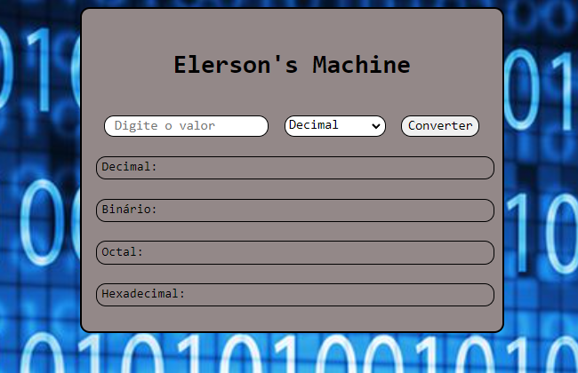

# Calculadora de Bases

> Preview

Esta é uma calculadora de bases, para utilizar ela, basta selecionar a base do número que você inseriu logo em seguida clicar em converter, onde aparecerá o número que foi inserido em algumas outras bases.

## Tecnologias
- HTML
- CSS
- JS.
